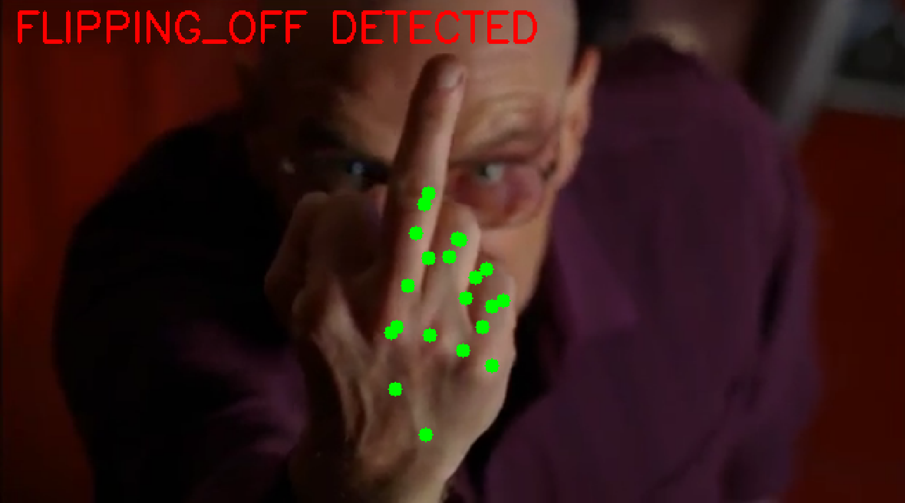

<!--markdownlint-disable MD013 MD033 MD041 -->

<div id="doc-begin" align="center">
  <h1 id="header">flipoff</h1>
  <p>Congratulations. You have reached the logical conclusion of your relationship with modern computing.</p>
</div>

<p align="center">
  <br/>
  
  <br/>
</p>

## Synopsis

flipoff is a Python-based utility that leverages _sophisticated computer vision_
to _solve the oldest problem in human-computer interaction_: the fact that your
machine is still running when you no longer wish it to be. It monitors your
webcam feed for a specific, globally recognized gesture of structural
disapproval, also known as the middle finger, and immediately executes a system
shutdown via D-Bus.

> [!IMPORTANT]
> **Disclaimer**
>
> I am not responsible if you use this while in a Zoom meeting and accidentally
> flip off your coworkers. Granted, that would be hilarious and I want to hear
> about it but I don't accept responsibility.

## Motivation

We live in an era of digital friction. Imagine you have just sat through a
three-hour "sync" meeting that could have been an email. Or that your IDE has
decided that your _perfectly valid_ syntax is actually a personal affront.
Perhaps rust-analyzer has safely leaked memory again. Your computer is just
standing there, even.

**YOU HATE IT ALL**.

For those kind of moments, conventional exit strategies are insufficient and
meaningless. They lack energy. They lack... catharsis. Thus, **flipoff** was
made. Built on three core pillars of modern engineering:

- Efficiency: Why move a mouse several inches when you can simply extend a
  single digit from the comfort of your keyboard?
- Emotional Honesty: Your computer should know exactly how you feel about its
  latest "Mandatory Update" during a presentation. Hate. Let me tell you about
  _hate_.
- The Final Word: There is no greater feeling of power than watching your
  monitor go black at the exact moment of your peak indignation.

We have spent decades teaching computers to understand our speech and our touch.
It was about time we taught them to understand our boundaries.

## Building & Development

### Prerequisites

- Python 3.11+
- [uv](https://github.com/astral-sh/uv)
- Bunch of system libraries (see `shell.nix` for a list)

Or, if you're sane, Nix. For now a very simple Nix development shell is provided
in `shell.nix`. Use either `diren allow` or `nix-shell` to get the dependencies.

### Running

```bash
# With webcam
$ uv run flipoff

# With debug overlay for landmarks
$ uv run flipoff --debug

# Dry run (no actual poweroff)
$ FLIPOFF_DRYRUN=1 uv run flipoff
```
